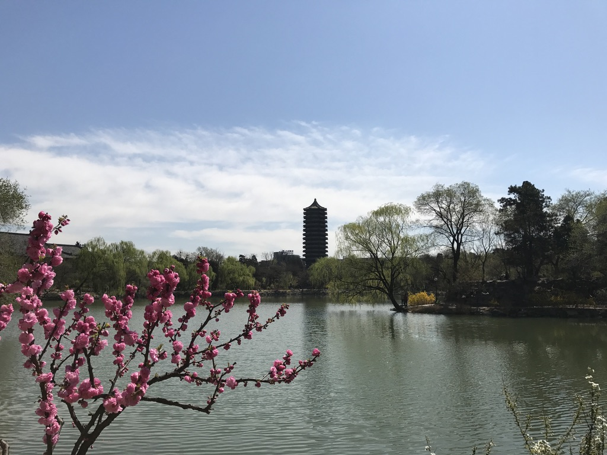

<h1 align="center"> Welcome to Xuan's website </h1>

I am currently a lecturer in [Research School of Finance, Actuarial Studies and Statistics](https://rsfas.anu.edu.au/) at Australian National Univerity. I got my Ph.D. degree in Statistics from [Guanghua School of Management](http://www.gsm.pku.edu.cn/) at Peking University in Jun 2017, under the supervision of [Prof. Song Xi Chen](https://www.songxichen.com/). During Aug 2017- Dec 2018, I worked as a postdoctoral fellow in [Department of Econometrics and Business Statistics ](https://www.monash.edu/business/econometrics-and-business-statistics) at Monash University, under the supervision of [Prof. Jiti Gao](https://users.monash.edu/~jgao/). 

**Education**
------
- 2017, Ph.D. in Statistics, Guanghua School of Management, Peking University, China. 
- 2012, B.Sc. in Statistics, Department of Mathematics, Zhejiang University, China.

**Research Interests**
------
Spatial data modelling, nonparametric statistics, network data modelling and environmental statistics.

